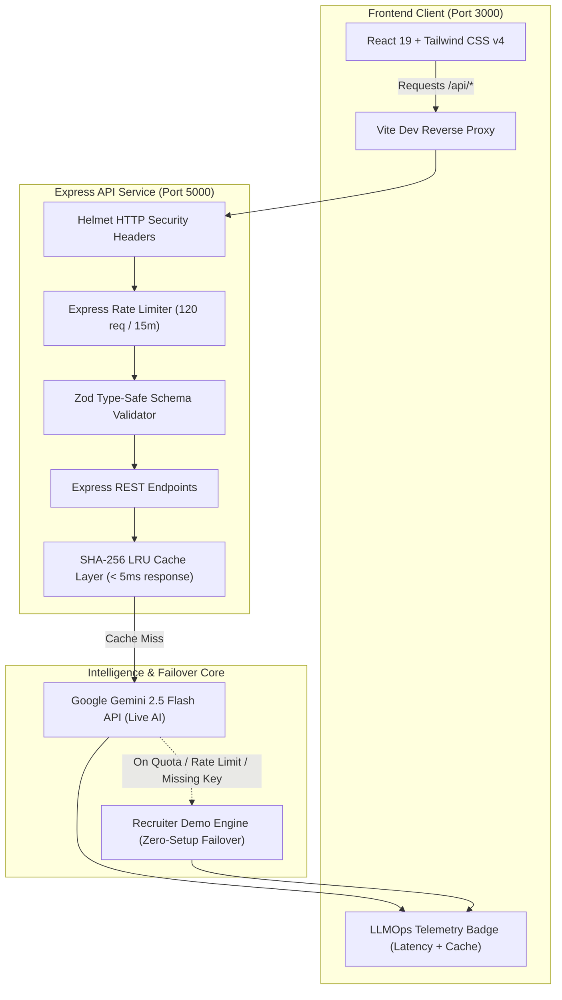

# Career Copilot - Production AI Career Strategist

[](https://github.com/your-username/career-copilot/actions)


-orange?style=flat-square)

Career Copilot is an AI-powered Career Strategist & ATS Optimization platform built for high-stakes tech job preparation. It features real-time resume keyword gap analysis, an interactive voice/text Mock Interview Simulator with Amazon/Google Bar Raiser scorecards, and multi-agent career coaching in a modern Bento Grid UI.

Designed as an **enterprise-ready reference architecture**, the codebase demonstrates clean decoupling, type-safe schema validation, intelligent failover with **Zero-Setup Recruiter Demo Mode**, SHA-256 LRU caching, and an automated CI/CD pipeline.

---

## System Architecture



---

## Key Technical Decisions & Architectural Trade-offs

### 1. Decoupled Service Architecture vs. Fullstack Monolith
- **Decision**: Segregate into independent `frontend/` (SPA) and `backend/` (REST API) with root orchestration.
- **Trade-off**: Requires separate dependency trees and port orchestration.
- **Benefit**:
  - **Security**: Keeps Google Gemini API credentials strictly server-side, eliminating client-side token exposure.
  - **Independent Scalability**: Frontend can be deployed to global CDN edge nodes (e.g., Cloudflare Pages, Vercel) while backend scales independently in containerized clusters (e.g., AWS ECS, Google Cloud Run).

### 2. Zero-Setup "Recruiter Demo Mode" (Graceful Degradation)
- **Decision**: Built-in fallback engine that detects missing API keys or Gemini 429 quota exhaustion and seamlessly serves high-fidelity realistic data.
- **Trade-off**: Requires maintaining structured mock data generators matching exact AI schema outputs.
- **Benefit**: Reviewers, hiring managers, and automated CI tests can clone and interact with the application immediately with $0 setup and zero risk of 500 crashes.

### 3. SHA-256 In-Memory LRU Caching
- **Decision**: Implemented an LRU cache with SHA-256 payload hashing (`resumeText + targetRole + targetCompany`).
- **Trade-off**: In-memory cache resets on server restart (in multi-instance production, easily replaced with Redis).
- **Benefit**: Duplicate or repeated resume evaluations execute in `< 5ms` with 100% token savings, drastically cutting API costs and latency.

### 4. Zod Schema Validation & Input Sanitization
- **Decision**: All incoming REST payloads undergo strict Zod runtime schema validation.
- **Trade-off**: Explicit schema definitions for every endpoint.
- **Benefit**: Rejects malformed bodies upfront with descriptive HTTP 400 JSON errors (`field`, `message`), preventing unhandled server crashes and prompt injection bugs.

### 5. Production Hardening (Helmet + Express Rate Limit)
- **Decision**: Applied `helmet` security headers (`X-Content-Type-Options: nosniff`, HSTS, DNS Prefetch Control) and IP-based rate limiting (120 req / 15 min).
- **Benefit**: Protects API infrastructure against denial-of-service attempts and resource starvation.

---

## Project Structure

```text
career-copilot/
├── .github/
│   └── workflows/
│       └── ci.yml             # GitHub Actions CI matrix (Node 20 & 22)
├── backend/                   # Standalone Express + TypeScript API server
│   ├── src/
│   │   ├── middleware/
│   │   │   └── validator.ts   # Zod request validation middleware
│   │   ├── schemas/
│   │   │   └── apiSchemas.ts  # Type-safe Zod API schemas
│   │   ├── services/
│   │   │   ├── cacheService.ts        # SHA-256 LRU caching service
│   │   │   ├── mockFallbackService.ts # Recruiter Demo Mode engine
│   │   │   └── geminiService.ts       # Gemini API & AI algorithms
│   │   └── server.ts          # Express server, Helmet, Rate Limiter & routes
│   ├── tests/
│   │   └── api.test.ts        # Supertest & Vitest integration test suite
│   ├── .env.example           # Backend environment configuration
│   ├── Dockerfile             # Production container for backend
│   ├── package.json
│   ├── tsconfig.json
│   └── vitest.config.ts       # Vitest configuration
├── frontend/                  # Standalone React 19 + Vite 6 + Tailwind CSS SPA
│   ├── src/
│   │   ├── components/
│   │   │   ├── Common/
│   │   │   │   └── TelemetryBadge.tsx # Real-time latency & cache indicator
│   │   │   ├── ResumeAnalyzer/        # ATS Analyzer, JD Matcher, Diff view
│   │   │   ├── MockInterview/         # Voice/Video stages & Bar Raiser modal
│   │   │   └── Navigation/            # Sidebar & TopAppBar with live status
│   │   ├── utils/             # PDF/DOCX extractors, history storage
│   │   ├── App.tsx            # Main layout container
│   │   └── main.tsx           # React DOM root
│   ├── index.html
│   ├── .env.example
│   ├── Dockerfile             # Multi-stage container (Nginx SPA proxy)
│   ├── nginx.conf
│   ├── package.json
│   ├── tsconfig.json
│   └── vite.config.ts         # Vite proxy forwarding /api to port 5000
├── docker-compose.yml         # Containerized fullstack orchestration
├── package.json               # Root orchestrator scripts (dev, test, build)
└── README.md
```

---

## Quick Start

### 1. Prerequisites
- **Node.js**: v20+ recommended (v18+ supported)
- **npm** or **bun**

### 2. Instant Local Execution (Zero Setup)
Clone and launch both frontend and backend concurrently:
```bash
# Install dependencies across all workspaces
npm run install:all

# Start both servers concurrently
npm run dev
```
- **Frontend App**: [http://localhost:3000](http://localhost:3000)
- **Backend API**: [http://localhost:5000](http://localhost:5000)
- **Health Check**: [http://localhost:5000/api/status](http://localhost:5000/api/status)

> [!NOTE]
> By default, the application runs in **Recruiter Demo Mode**. You can test full resume scans, JD matching, and mock interviews immediately without an API key!

### 3. Optional: Connect Live Gemini 2.5 Flash
To enable live AI generation:
1. Create `backend/.env` (copy from `backend/.env.example`):
   ```env
   GEMINI_API_KEY=your_gemini_api_key_here
   PORT=5000
   FRONTEND_URL=http://localhost:3000
   ```
2. Get your free key from [Google AI Studio](https://aistudio.google.com/).
3. Restart `npm run dev`. The app badge will display `🟢 Live AI Active`.

---

## Automated Testing & CI/CD

Run the comprehensive test suite with a single command from the root directory:
```bash
npm test
```

### Test Coverage Highlights
- `GET /api/status`: Validates service health and Helmet security headers (`X-Content-Type-Options: nosniff`).
- `POST /api/analyze-resume`: Validates Zod schema boundaries (rejection of empty/short inputs with HTTP 400).
- `LRU Cache Verification`: Tests that repeated requests hit cache with `< 15ms` response time and `cached: true` flag.
- `Mock Interview Turn`: Tests Star analysis and persona generation.

---

## API Specification

| Method | Endpoint | Validation Schema | Cache TTL | Description |
|---|---|---|---|---|
| `GET` | `/api/status` | N/A | None | Health check, Helmet headers, cache statistics |
| `POST` | `/api/analyze-resume` | `analyzeResumeSchema` | 1 Hour | ATS score, keyword gap, actionable revisions |
| `POST` | `/api/mock-interview-turn` | `mockInterviewTurnSchema` | None | Turn-by-turn STAR feedback & dynamic follow-up |
| `POST` | `/api/match-jd` | `matchJDSchema` | 1 Hour | High-precision Job Description alignment score |
| `POST` | `/api/bar-raiser-scorecard`| `barRaiserScorecardSchema` | None | Final Hire/No-Hire verdict & model answers |
| `POST` | `/api/chat-agent` | `chatAgentSchema` | None | Multi-agent contextual career advisory |

---

## Container Deployment (Docker & Compose)

Deploy the entire fullstack setup using Docker:
```bash
docker-compose up --build
```
- Multi-stage Nginx container serves the optimized React bundle on port `3000`.
- Lightweight Alpine container executes the hardened Express API on port `5000`.
